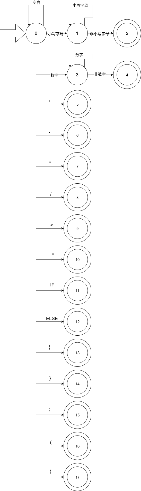

# 小型语言词法分析器
## 第一部分 语言形式化描述
### 1.1 语言的字母表
$$ \Sigma=\{a,b,c,d,e,f,g,h,i,j,k,l,m,n,o,p,q,r,s,t,u,v,w,x,y,z,+,-,*,/,<,=,(,),IF,\{,\},ELSE,1,2,3,4,5,6,7,8,9,0,;\} $$

### 1.2 语言的文法
定义语言的文法如下：
$$
G[S]=(V_N,V_T,P,S)\\
V_N=\{S,E,T,F,A,L,B,C,D,J,INT,VAR\}\\
V_T=\Sigma\\
P定义为:\\
S\rightarrow SA;|SJ;|A;|J;\\
\# 简单算术表达式\\
E\rightarrow E+T|E-T|T\\
T\rightarrow T*F|T/F|F\\
F\rightarrow (E)|INT|VAR\\
INT\rightarrow 1INT|2INT|3INT|4INT|5INT|6INT|7INT|8INT|9INT|0|1|2|3|4|5|6|7|8|9\\
VAR\rightarrow aVAR|bVAR|cVAR|dVAR|eVAR|fVAR|gVAR|hVAR|iVAR|jVAR|kVAR|lVAR|mVAR|nVAR|oVAR|pVAR|qVAR|rVAR|sVAR|tVAR|uVAR|vVAR|wVAR|xVAR|yVAR|zVAR|a|b|c|d|e|f|g|h|i|j|k|l|m|n|o|p|q|r|s|t|u|v|w|x|y|z\\
\# 赋值语句\\
A\rightarrow VAR=E\\
\# 逻辑表达式\\
L\rightarrow E<E|E\\
\# IF语句\\
J\rightarrow IF\{L\}\{S\}|IF\{L\}\{S\}ELSE\{S\}\\
$$
在构建词法分析器时，暂不考虑运算优先级问题，可以适当对文法进行简化。简化后的文法如下，采用EBNF：
$$
P:\\
S\rightarrow \{(A;|J;)\}\\
E\rightarrow \{((INT|VAR)\{(+|-|*|/)(INT|VAR)\}|((INT|VAR)\{(+|-|*|/)(INT|VAR)\}))\}\\
A\rightarrow VAR:E\\
INT\rightarrow 0|(1|2|3|4|5|6|7|8|9)\{(0|1|2|3|4|5|6|7|8|9)\}\\
VAR\rightarrow \{(a|b|c|d|e|f|g|h|i|j|k|l|m|n|o|p|q|r|s|t|u|v|w|x|y|z)\}\\
J\rightarrow IF\{L\}\{S\}|IF\{L\}\{S\}ELSE\{S\} \#此处的'\{'和'\}'是终结符\\ 
L\rightarrow E<E|E\\
$$

## 第二部分 单词编码表
规定属性字长度为8位，其中前3位为类别号，后5位为属性值。

类别号表：
| 类别   | 类别号 |
| ------ | ------ |
| 关键字 | 000    |
| 标识符 | 001    |
| 常数   | 010    |
| 运算符 | 011    |
| 界限符 | 100    |

关键字表：
| 关键字 | 属性值 |
| ------ | ------ |
| IF     | 00000  |
| ELSE   | 00001  |

运算符表：
| 运算符 | 属性值 |
| ------ | ------ |
| +      | 00000  |
| -      | 00001  |
| *      | 00010  |
| /      | 00011  |
| =      | 00100  |
| <      | 00101  |
| (      | 00110  |
| )      | 00111  |

界限符表：
| 界限符 | 属性值 |
| ------ | ------ |
| {      | 00000  |
| }      | 00001  |
| ;      | 00010  |

## 第三部分 状态转换图

## 第四部分 词法分析算法
对于给定的文法，可以通过状态转换图得到词法分析算法。算法如下：
## 第五部分 测试计划（报告）